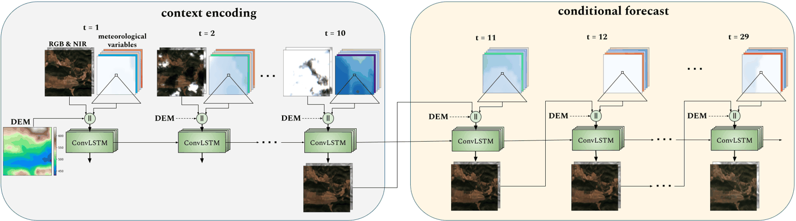

## *Understanding the Role of Weather Data for Earth Surface Forecasting using a ConvLSTM-based Model*

This repository accompanies the paper *Understanding the Role of Weather Data for Earth Surface Forecasting using a ConvLSTM-based Mode*: [link](https://openaccess.thecvf.com/content/CVPR2022W/EarthVision/papers/Diaconu_Understanding_the_Role_of_Weather_Data_for_Earth_Surface_Forecasting_CVPRW_2022_paper.pdf)

## Structure
1. `code`: it includes the code used to train the model (check `code\readme.md` for instructions on how to retrain a model)
2. `models`: it includes the path to the trained model used to obtain most of the predictions reported in the paper and in this repository (check `models\readme.md`)
3. `supl`: supplementary materials which are not be included in the paper, check `supl\readme.md` for a full description
   1. `supl/predictions`: RGB & NIR predictions for five random samples together with the corresponding ground truth
   2. `supl/simulations`: RGB & NIR predictions for five random samples, shown as animations, obtained by individually perturbing each of the meteorological conditions. Additional to the results reported in the paper (which focused on rainfall only), we include here also those for **sea level pressure** and **temperature**. 
